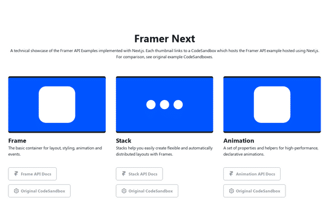

  

  <h1 align="center">Framer NeXt.js</h1>

  

    Supplementary:
    <a href="https://github.com/nataliemarleny/framernext-examples">Framer API implemented in Next.js Examples Repository</a>
  

This Next.js static site is a technical showcase of the Framer X API Examples implemented within a production React Application environment. Each thumbnail links to a CodeSandbox which hosts the <a href="https://www.framer.com/api/examples">Framer API example</a> built within <a href="https://nextjs.org">Next.js</a>.

Each Framer X API example links to the documentation and original Framer Codesandbox to compare and contrast.

🖤 This site is deployed using ZEIT Now 2.0 <a href="https://zeit.co/blog/zero-config">0config deployments</a> 🖤

💙 For styling and components, this site is a fork of <a href="https://primer.style">primer.style</a>, which has been created and maintained by GitHub’s <a href="https://primer.style/team">Design Systems team</a> 💙

The Primer design system is available for use under the MIT license.

---

## Disclaimers!

- Putting the Framer X API into a production React application is definitely more of a could than a should! This is mainly a technical exercise!, but also a celebration of the technologies and communities which have enabled me to have a career flourishing as a Software Engineer 👩🏻‍💻

- To make the examples work, it was necessary to rewrite some of Framer's the custom React Hooks (with particular reference to useCycle).

- Scrolling example does not fully work (fails silently)

- The Transforms API example sadly did not translate.

---

## ¡Gracias!

#### Framer Next was created as part of the Community Show & Tell for <a href="https://framer.com/loupe">Framer Loupe 2019</a> by:

- [@nataliemarleny](https://github.com/nataliemarleny)

#### With a tiny PR and a big thank you to:

- [@timneutkens](https://github.com/timneutkens)

#### Also with thanks and gratitude to:

- [@ZEIT](https://github.com/zeit)
- [@arunoda](https://github.com/arunoda)
- [@leo](https://github.com/leo)
- [@nextjs](https://github.com/zeit/next.js)
- [@framer](https://github.com/framer)
- [@marciano](http://marcia.no)
- [@anushreesubramani](https://github.com/anushreesubramani)
- [@codesandbox](https://github.com/codesandbox)
- [@primer](https://github.com/primer)
